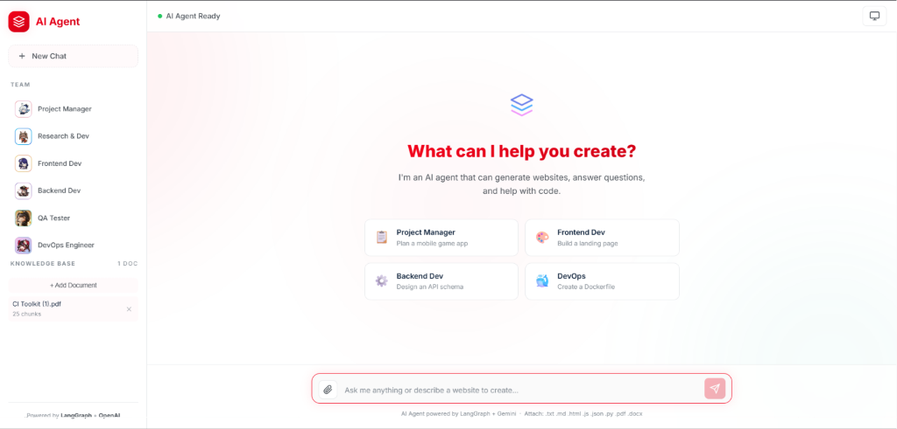
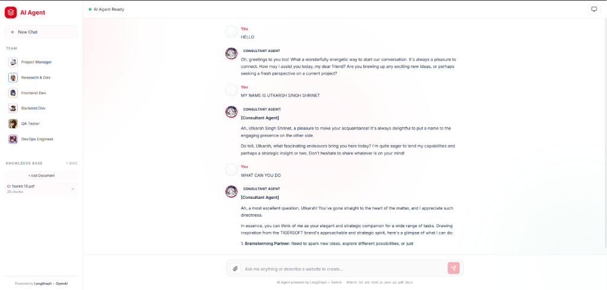

# Multi-Agent AI System — Website Creator

A comprehensive Multi-Agent AI system for website creation and software development, built with 8 specialized AI agents working together via LangGraph.

---

## Overview

This application utilizes the **Supervisor/Orchestrator Pattern** to route user requests to appropriate agents. Each agent specializes in a specific domain, and all agents are configured with the **TIGERSOFT Brand Guidelines** to ensure outputs align with the company's Design System.

```
User Input
    └─→ Supervisor Agent (routing)
            ├─→ PM Agent
            ├─→ R&D Agent
            ├─→ Frontend Agent  ─→  Generate Website (HTML/CSS/JS)
            ├─→ Backend Agent
            ├─→ Tester (QA) Agent
            ├─→ DevOps Agent
            └─→ Consultant Agent
```




---

## Tech Stack

| Layer | Technology |
|-------|-----------|
| Frontend | Vanilla JavaScript, HTML5, CSS3 |
| Backend | FastAPI, Python |
| Agent Framework | LangGraph + LangChain |
| LLM | OpenAI GPT-4o / Google Gemini |
| Vector DB | ChromaDB + all-MiniLM-L6-v2 |
| File Parsing | pypdf, python-docx |
| Web Server | Uvicorn (ASGI) |

---

## Project Structure

```
Multi-Agent-with-UI-create-website/
├── .agents/                    # Skill definitions (prompt injection per agent)
│   ├── PM/skill.md
│   ├── Frontend/skill.md
│   ├── Backend/skill.md
│   ├── RD/skill.md
│   ├── DevOps/skill.md
│   ├── Tester(QA)/skill.md
│   ├── Consultant/skill.md
│   └── Supervisor/skill.md
├── backend/
│   ├── agent.py                # LangGraph multi-agent orchestration
│   ├── main.py                 # FastAPI server & API routes
│   └── rag.py                  # RAG layer (ChromaDB + embeddings)
├── frontend/
│   ├── index.html              # Single-page application
│   ├── app.js                  # Client-side logic
│   └── style.css               # TIGERSOFT Design System
├── public/Image/               # Agent avatar images
├── chroma_db/                  # Local vector store (auto-generated)
├── design.md                   # TIGERSOFT Brand Identity guidelines
├── requirements.txt
└── .env
```

---

## Installation

### 1. Install Dependencies

```bash
pip install -r requirements.txt
```

For PDF and DOCX support:

```bash
pip install pypdf python-docx
```

### 2. Configure API Keys

Create or edit the `.env` file:

```env
# Optional: Use OpenAI
OPENAI_API_KEY=your_openai_key_here

# Optional: Use Google Gemini Developer API (default fallback)
Google_genai=your_gemini_key_here

# Optional: Use OpenRouter
OPENROUTER_API_KEY=your_openrouter_key_here
OPENROUTER_MODEL=google/gemini-2.5-flash # optional, defaults to google/gemini-2.5-flash
```

### 3. Run the Server

```bash
python backend/main.py
```

Open your browser at `http://localhost:8000`

---

## API Endpoints

| Method | Path | Description |
|--------|------|-------------|
| `GET` | `/api/health` | Health check |
| `POST` | `/api/chat` | Send message to agents |
| `POST` | `/api/upload` | Upload file to Knowledge Base |
| `GET` | `/api/documents` | List documents in the Knowledge Base |
| `DELETE` | `/api/documents/{id}` | Delete document from the Knowledge Base |

---

## Agent Roster & Responsibilities

| Agent | Responsibility |
|-------|--------|
| **Supervisor** | Analyzes requests and routes to the appropriate specialist agent |
| **PM** | Project planning, writing requirements, user stories |
| **R&D** | Investigates new tech, designs architecture, tech stack selection |
| **Frontend** | Creates websites in HTML/CSS/JS (single-file, vanilla) |
| **Backend** | API design, database schema creation |
| **Tester (QA)** | Test cases and QA plan creation |
| **DevOps** | Docker configuration, CI/CD pipeline scripts |
| **Consultant** | General Q&A, brainstorming, small talk |

---

## Key Features

- **Live HTML Preview** — Render generated websites instantly inside an iframe
- **Download Project** — Download the generated HTML files directly
- **Knowledge Base (RAG)** — Upload files (.txt, .pdf, .docx, .md) to ground the agents with custom context
- **Chat History** — Send the 10 most recent messages for chat context
- **Agent Badges** — Display badges showing which agent is responding (e.g., `[Frontend Agent]`)
- **Dual LLM Support** — Switch between GPT-4o and Gemini in `agent.py`

---

## Changing the LLM

Open `backend/agent.py` and modify lines 51-55:

```python
# Use OpenAI GPT-4o
llm = ChatOpenAI(model="gpt-4o", temperature=0.7)

# Or use Google Gemini (default)
llm = ChatGoogleGenerativeAI(model="gemini-2.0-flash", temperature=0.7)
```

---

## Design System

UI utilizes the **TIGERSOFT Brand Identity** as defined in `design.md`:

| Color Name | Hex |
|-----|-----|
| Vivid Red (Primary) | `#F4001A` |
| Oxford Blue | `#0B1F38` |
| UFO Green | `#50C8B5` |
| White | `#FFFFFF` |
| Quick Silver | `#A3A3A3` |

Uses glassmorphism, gradient overlays, micro-animations, and responsive layouts (375px - 1440px).

---

## Notes

- `chroma_db/` is automatically created on the first run.
- Frontend is built with Vanilla JS, no build step required.
- CORS is open (all origins), suitable for local development.
- Server runs with `reload=True` (auto-reload on code changes).
